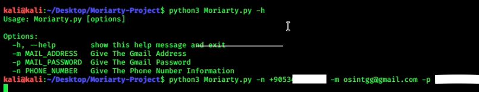

# Moriarty-Project
# 
# What IS Moriarty?
- Advanced Information Gathering And Osint Tool
- Moriarty is a tool that tries to find good informations about the phone number that you provied;

->Tries To Find Owner Of The Number

->Tries To Find Risk Level Of The Number

->Tries To Find Location,Time Zone Of The Number,Carrier

->Tries To Find Social Media Platforms That The Number Is Registered

->Tries To Find Links About Phone Number

->Tries To Find Comments About Phone Number

->Sends Sms To Phone Number With Amazon Aws
# Installation
* chmod 755 install.sh
* ./install.sh

# Usage

# Output

# Sending Sms

* It is necessery to have an amazon aws account otherwise sms won't be sent.
