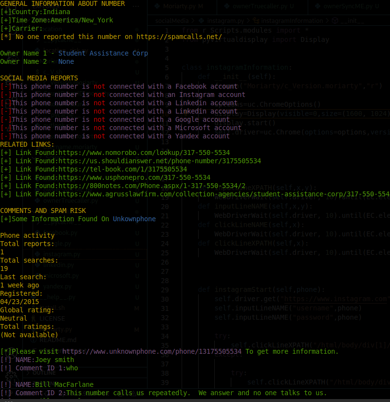

# Moriarty-Project V3.0

# Situation - Moriarty-Project V3.0
Updated. Next update date: 10/04/2022

# What IS Moriarty?
#### Moriarty tries to find important information about a spesific phone number. Features:
- Tries to find the owner of the phone number
- Spam risk
- Comments about the phone number
- Linked social media platforms
- reports, searches, duckduckgo results etc.

# Installation
> chmod 755 install.sh
> 
> bash install.sh

# Usage
#### Use this command if you're running this tool for the first time:
> python3 Moriarty.py -pn +PHONE_NUMBER_WITH_COUNTRY_CODE
#### If you have run this tool before you can use this command:
> python3 Moriarty.py -rf -pn +PHONE_NUMBER_WITH_COUNTRY_CODE
#### If you don't want to get social media reports use this command:
> python3 Moriarty.py --no-social-media -rf -pn +PHONE_NUMBER_WITH_COUNTRY_CODE
> or
> python3 Moriarty.py --no-social-media -pn +PHONE_NUMBER_WITH_COUNTRY_CODE

# How does this tool work?
### It's so easy to figure actually. This tool uses selenium for automating browser actions.
### Websites that are used in this Project:
> Truecaller
> 
> SyncME
> 
> Unkown Phone
> 
> Social Media Platforms(facebook,instagram,yandex,google,microsoft,linkedin)
> 
> Duckduckgo
> 
> Unkownphone
> 
> Whocallsme
> 
> spamcalls
> 

# Mobile
* This tool doesn't work on kali nethunter,termux or any other mobile operating systems.

# Note
* Microsoft mail address is required but it does not have to be the one that you're using currently. You can create a fake microsoft account for this project.
* This tool will not steal your account. Codes are opensource you can check.
* If you're having error with running this tool, use normal account on linux(i mean don't be root, run it as a normal user)
* If you want me to add new features please let me know

