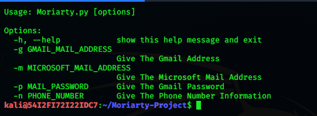
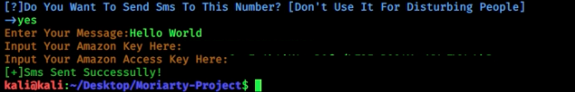

# Moriarty-Project V2.4
 
# 
# What IS Moriarty?
- Advanced Information Gathering And Osint Tool
- Moriarty is a tool that tries to find good information about the phone number that you provieded;

->Tries To Find Owner Of The Number

->Tries To Find Risk Level Of The Number

->Tries To Find Location,Time Zone Of The Number,Carrier

->Tries To Find Social Media Platforms That The Number Is Registered

->Tries To Find Links About Phone Number

->Tries To Find Comments About Phone Number

->Sends Sms To Phone Number With Amazon Aws
# TO Contact

Facebook:https://www.facebook.com/aziz.kaplan.96387

Instagram:https://www.instagram.com/aziz.kpln
# Installation
* chmod 755 install.sh
* ./install.sh
# Note About Installation
* This tool has to be run as non-root. And it has to be downloaded in the directory that doesnt require any root permission. That feature will be added in the next release
# Usage

* python3 Moriarty.py -m microsoft_mail@outlook.com -p password -n +phone_number
* python3 Moriarty.py -g gmail_mail@gmail.com -p password -n +phone_number

# Output

# Sending Sms

* It is necessery to have an amazon aws account otherwise sms won't be sent.

# CURRENT VERSION:
* v2.4

# Note
* Please don't use your real gmail account open a fake account and don't add your phone number for better usage of the tool.
* This tool will not steal your account. Codes are opensource you can check.

