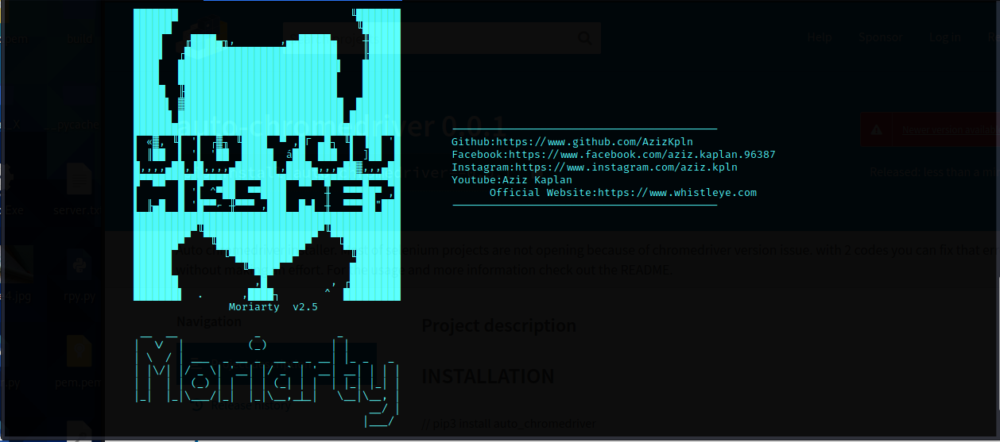

# Moriarty-Project V2.6

# 

# What IS Moriarty?
- Advanced Information Gathering And Osint Tool
- Moriarty is a tool that tries to find good information about the phone number that you provieded;

->Tries To Find Owner Of The Number

->Tries To Find Risk Level Of The Number

->Tries To Find Location,Time Zone Of The Number,Carrier

->Tries To Find Social Media Platforms That The Number Is Registered

->Tries To Find Links About Phone Number

->Tries To Find Comments About Phone Number

->Sends Sms To Phone Number With Amazon Aws
# TO Contact

* Facebook:https://www.facebook.com/aziz.kaplan.96387

* Instagram:https://www.instagram.com/aziz.kpln

# Installation
> chmod 755 install.sh
> ./install.sh

# Usage

> python3 Moriarty.py -m microsoft_mail@outlook.com -p password -n +phone_number

# Usage Example
> python3 Moriarty.py -m mymicrosoft@outlook.com -p mypasswoed -n +9054xxxxxxxx

# Output

# Mobile
* This tool doesn't work on kali nethunter,termux or any other mobile operating systems. You can use this tool on this website: https://www.whistleye.com

# Note
* Microsoft mail address is required but it does not have to be the one that you're using currently. You can create a fake microsoft account for this project.
* This tool will not steal your account. Codes are opensource you can check.

